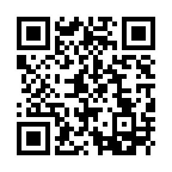

# 副反応ダッシュボード

厚生労働省のサイトにてPDF形式で掲載されている「新型コロナワクチン副反応疑い報告」のデータを見やすく整理し、 多くの人にとって見やすく、データから知見を得やすくするためのサイトです。以下のリンクからご覧いただけます。

> [副反応ダッシュボード](https://vaccinesosjapan.github.io/dashboard/#/)

スマートフォンやタブレットなどからご覧いただく際には、以下のQRコードを読み取っていただければ上記リンクを開けます。

